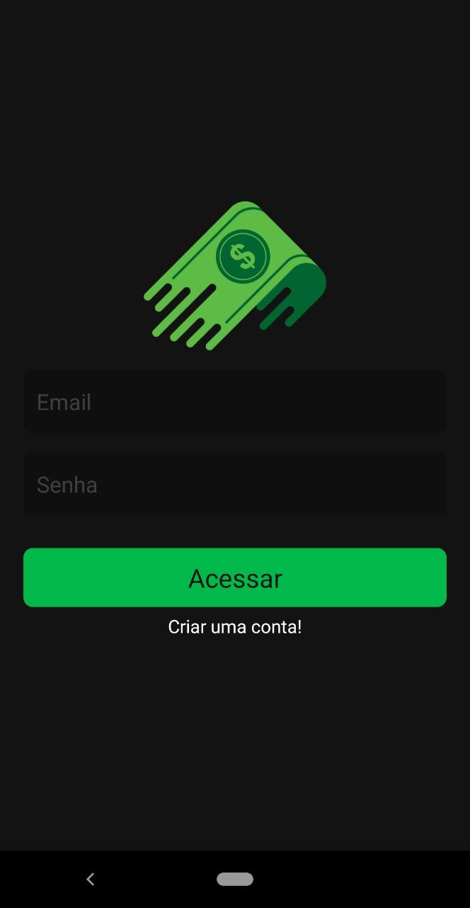
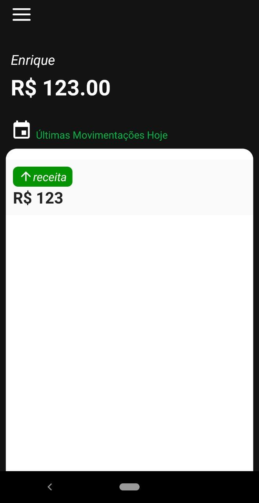
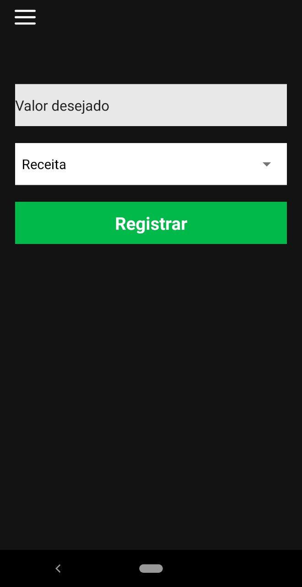
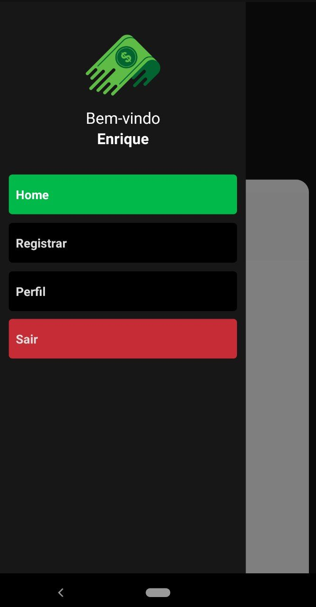

# Finanças App :moneybag:


🚧  Finanças App :moneybag: Em construção...  🚧

## Tabela de conteúdos
<!--ts-->
   * [Sobre](#sobre)
   * [Tabela de Conteudo](#tabela-de-conteúdos)
   * [Layout](#layout)
   * [Como usar](#como-usar)
      * [Pré-requisitos](#pré-requisitos)
      * [Configurando o Backend](#wrench-configurando-o-backend)
      * [Rodando o aplicativo](#iphone-rodando-o-aplicativo)
   * [Tecnologias](#computer-tecnologias)
   * [Como Contribuir](#muscle-como-contribuir-para-o-projeto)
   * [Autor](#boy-autor)
   * [Licença](#-licença)
<!--te-->

---

## Sobre
Aplicativo para registrar receitas e despesas de maneira simples, como um caderno de anotações.

Projeto desenvolvido durante um módulo do curso [**Fábrica de Aplicativos**](https://sujeitoprogramador.com/fabricadeaplicativos/?ref=J36424210D).

---

## Layout
<p align="center">
  

  
</p>

<p align="center">
  

  
</p>

___

## Como usar
Esse projeto está dividido em duas partes:
1. Backend (Diretório services)
2. Mobile (Referente aos demais arquivos do projeto)

### Pré-requisitos
Para começar, você precisa ter instalado as seguintes ferramentas: [Git](https://git-scm.com), [Node.js](https://nodejs.org/en/), [Expo](https://expo.io/).
Também é necessário ter uma conta no [Firebase](https://firebase.google.com/).

Agora é só clonar o repositório e entrar nele:
```bash
# Clone este repositório
$ git clone https://github.com/EnriqueIzel2/financas-app.git

$ cd financas-app
```

#### :wrench: Configurando o Backend
:exclamation: O backend do projeto utiliza os serviços do Firebase. Por isso é necessário que você tenha uma conta e crie um projeto na plataforma.

1. No seu projeto crie os serviços de **Authentication** e **Realtime Database**
2. Adicione um novo app na opção **Adicionar app** e escolha a opção **Web**
3. Copie a variável **firebaseConfig**
4. Depois edite o arquivo [firebaseConnection.js](https://github.com/EnriqueIzel2/financas-app/blob/master/src/services/firebaseConnection.js) colocando as configurações fornecidas pelo firebase.

Pronto, nosso backend está o fino do fino. :sunglasses:

#### :iphone: Rodando o aplicativo
Nossa aplicação utiliza o expo, então você pode emular ela em seu computador(com um emulador de sua preferência), ou diretamente no seu celular.
Para utilizar no seu celular basta fazer o download do **expo** na [Google Play](https://play.google.com/store/apps/details?id=host.exp.exponent) ou [App Store](https://apps.apple.com/br/app/expo-client/id982107779).

```bash
# Instale as dependências com
$ yarn install
#ou
$ npm install

# Execute a aplicação em mode de desenvolvimento
$ expo start
```
Você será direcionado para a página http://localhost:19002/.
* Se você estiver usando o celular, basta ler o QRcode e sua aplicação vai ser instalada.
* Se você estiver usando emulador, é só clicar em **Run on Android device/emulator** ou **Run on IOS emulator**.

---

## :computer: Tecnologias
As seguintes ferramentas foram usadas na construção do projeto:

### **Backend**
   - **[Firebase](https://firebase.google.com/)**
  
> Veja o arquivo  [package.json](https://github.com/EnriqueIzel2/financas-app/blob/master/package.json)

### **Mobile**
   - **[React Native](http://www.reactnative.com/)**
   - **[Expo](https://expo.io/)**
   - **[React Navigation](https://reactnavigation.org/)**
   - **[Date-fns](https://date-fns.org/)**
   - **[Styled-components](https://styled-components.com/)**
   - **[React Native Async Storage](https://github.com/react-native-community/async-storage)**
   - **[React Native DateTimePicker](https://github.com/react-native-community/datetimepicker)**
   - **[React Native Picker](https://github.com/react-native-community/react-native-picker)**
   - **[Firebase](https://docs.expo.io/guides/using-firebase/)**

> Veja o arquivo  [package.json](https://github.com/EnriqueIzel2/financas-app/blob/master/package.json)

---

## :muscle: Como contribuir para o projeto

1. Faça um **fork** do projeto.
2. Crie uma nova branch com as suas alterações: `git checkout -b my-feature`
3. Salve as alterações e crie uma mensagem de commit contando o que você fez: `git commit -m "feature: My new feature"`
4. Envie as suas alterações: `git push origin my-feature`

---

## :boy: Autor

<a href="https://github.com/EnriqueIzel2">
 
 <br />
 <sub><b>Enrique Izel</b></sub>
</a>
 <br />

[](https://twitter.com/Enrique_Izel)
[](https://www.linkedin.com/in/enrique-izel-developer/) 
[](mailto:eleaoizel@gmail.com)

---

## 📝 Licença

Este projeto esta sobe a licença [MIT](./LICENSE).
